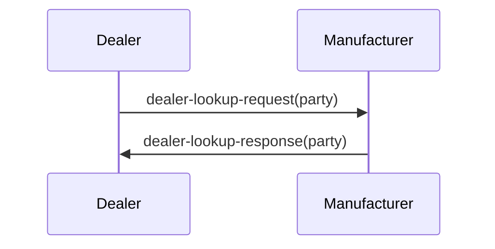

# Dealer lookup request and response
*Note: This commit is tagged as version 0.9. AgGateway needs to complete a couple of quality checks before releasing version 1.0. The only anticipated changes would be to the cardinality of some components.*

From time to time dealers need to determine the identifier of another dealer to support various supply chain operations, notably product transfers. Furthermore, they may need to know the whether the manufacturer regards the identified dealer as elligible to recieve product transfers. The following UML sequence diagram describes the process of a pair of messages to support these requirements.

This repository includes dealer-lookup-request and dealer-lookup-response as profiles (i.e., BIEs) of OAGi's connectSpec Party component. Each profile is expressed in W3C XML Schema (i.e., XSD) and JSON Schema with example instance documents for each of the four. Note that all four schema expressions include documentation.
